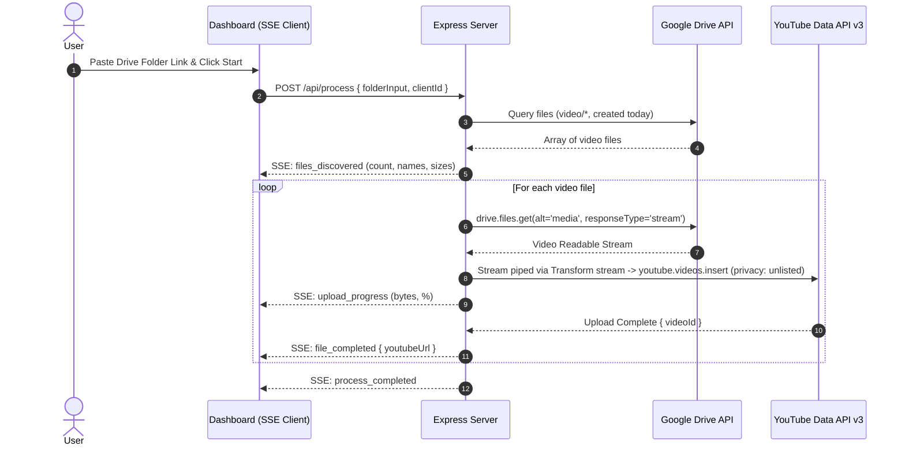

# 🎥 Google Drive to YouTube Unlisted Video Streaming Pipeline

An internal organization automation tool built with **Node.js**, **Express**, and **Server-Sent Events (SSE)**. It scans a designated Google Drive folder for videos created today, streams them directly to your YouTube channel as **Unlisted** videos (zero server memory buffering), and provides a live progress tracking dashboard.

---

## ⚡ Key Highlights

- **Zero RAM Buffering**: Streams the video chunk-by-chunk from Google Drive to YouTube using Node.js `stream.Transform` without downloading files locally or loading entire gigabytes into RAM.
- **Headless OAuth2**: Runs headlessly using a persistent `refresh_token` stored in `.env` — no repeated logins needed.
- **Real-Time Live Tracking**: Real-time progress bar (MB transferred and %) powered by **Server-Sent Events (SSE)**.
- **Automated Today Filter**: Automatically isolates files where `mimeType contains 'video/'` and `createdTime` is from midnight today to current time.
- **Strict Privacy Mode**: Automatically sets video title to original filename and `privacyStatus` strictly to `unlisted`.

---

## 📂 Project Structure

```
├── server.js              # Express backend with Drive & YouTube direct streaming engine + SSE
├── get-refresh-token.js   # Interactive OAuth CLI utility to generate initial refresh_token
├── public/
│   └── index.html         # Tailwind CSS UI Dashboard + SSE live tracker & console
├── .env.example           # Environment template
├── package.json           # Project dependencies & scripts
└── README.md              # Setup and usage guide
```

---

## 🚀 Quick Setup Guide

### 1. Install Dependencies

```bash
npm install
```

---

## 🔐 Google Cloud Console Setup (Step-by-Step)

Follow these steps to obtain your `GOOGLE_CLIENT_ID`, `GOOGLE_CLIENT_SECRET`, and `GOOGLE_REFRESH_TOKEN`:

### Step 1: Create a Google Cloud Project
1. Go to the [Google Cloud Console](https://console.cloud.google.com/).
2. Click the Project dropdown in the top bar and click **New Project**.
3. Name it (e.g., `Drive-to-YouTube-Uploader`) and click **Create**.

### Step 2: Enable the Required APIs
1. Go to **APIs & Services > Library**.
2. Search for **Google Drive API**, click it, and click **Enable**.
3. Return to the Library, search for **YouTube Data API v3**, click it, and click **Enable**.

### Step 3: Configure the OAuth Consent Screen
1. Go to **APIs & Services > OAuth consent screen**.
2. Select **Internal** (if using Google Workspace) or **External** (if using a standard Google account), then click **Create**.
3. Fill in the required fields:
   - **App name**: `Drive to YouTube Streamer`
   - **User support email**: Select your email
   - **Developer contact information**: Enter your email
4. Click **Save and Continue**.
5. In the **Scopes** step, click **Add or Remove Scopes** and add:
   - `https://www.googleapis.com/auth/drive.readonly`
   - `https://www.googleapis.com/auth/youtube.upload`
6. Click **Save and Continue**.
7. *(If External)* In the **Test users** step, click **Add Users** and add the Google Account / YouTube channel owner email. Click **Save and Continue**.

### Step 4: Create OAuth 2.0 Client Credentials
1. Go to **APIs & Services > Credentials**.
2. Click **+ CREATE CREDENTIALS** at the top and select **OAuth client ID**.
3. Set **Application type** to **Web application**.
4. Set **Name** to `Uploader Web Client`.
5. Under **Authorized redirect URIs**, click **+ ADD URI** and enter:
   ```
   http://localhost:3000/oauth2callback
   ```
6. Click **Create**.
7. Copy your **Client ID** and **Client Secret**.

---

## 🔑 Generate the Permanent Refresh Token

1. Copy `.env.example` to `.env`:
   ```bash
   cp .env.example .env
   ```
2. Paste your `GOOGLE_CLIENT_ID` and `GOOGLE_CLIENT_SECRET` into `.env`.
3. Run the interactive token generator:
   ```bash
   npm run get-token
   ```
4. Follow the prompt in your terminal:
   - Open the displayed authorization URL in your browser.
   - Sign in with the Google Account associated with your YouTube Channel.
   - Grant the Drive and YouTube permissions.
5. The terminal will automatically capture the token and display your `GOOGLE_REFRESH_TOKEN`.
6. Add `GOOGLE_REFRESH_TOKEN` to your `.env` file.

Your `.env` file should look like:
```env
PORT=3000
GOOGLE_CLIENT_ID=1234567890-abcdefg.apps.googleusercontent.com
GOOGLE_CLIENT_SECRET=GOCSPX-xxxxxxxxxxxxxxxx
GOOGLE_REDIRECT_URI=http://localhost:3000/oauth2callback
GOOGLE_REFRESH_TOKEN=1//04xxxxxxxxxxxxxxxxxxxxxxxxxxxxxxxxxxxx
```

---

## 🖥️ Running the Application

1. Start the server:
   ```bash
   npm start
   ```
   *(For development with auto-reload: `npm run dev`)*

2. Open your browser:
   ```
   http://localhost:3000
   ```

3. Paste your Google Drive Folder Link (or Folder ID) and click **Start Process**.

---

## ⚙️ How It Works Internally


