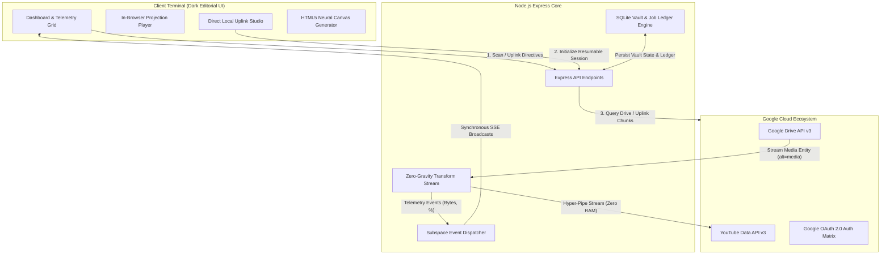
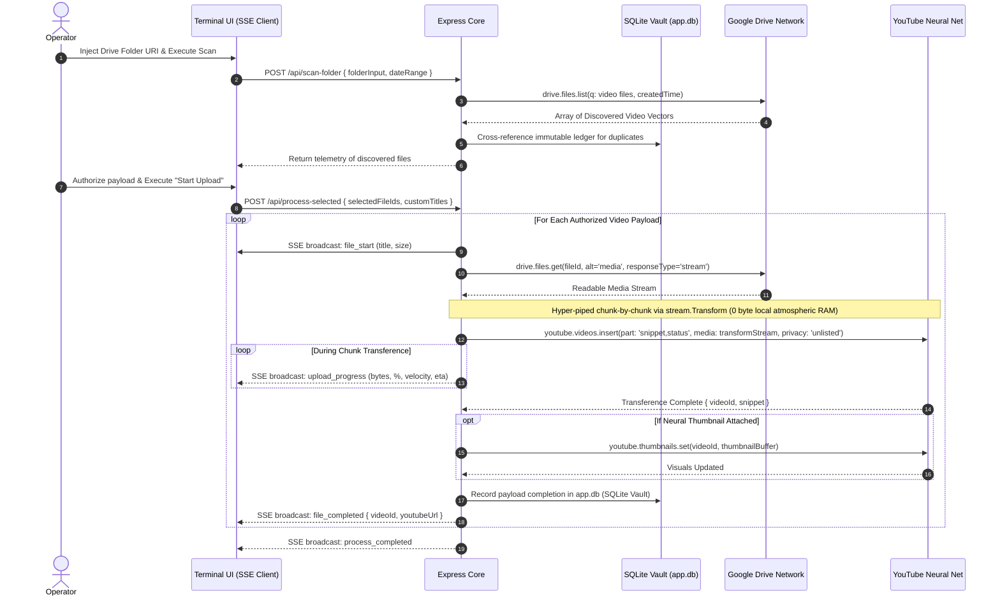

# 🌌 NEXUS: Next-Gen YouTube & Cloud Ingestion Matrix

A hyper-scale, autonomous, zero-gravity (zero-RAM) streaming pipeline and cybernetic video management nexus powered by **Node.js**, **Express**, **Tailwind CSS**, and **Real-Time Subspace Broadcasts (SSE)**.

Forged with an ultra-modern **Dark Editorial Holographic UI**, this studio establishes an autonomous bi-directional bridge between Google Drive and YouTube. It orchestrates zero-RAM media ingestion directly to YouTube as **Unlisted** assets, while featuring a **Direct Local Device Uplink Studio** complete with instantaneous in-browser previewing, 16:9 neural thumbnail synthesis, and quantum-speed telemetry.

---

## ⚡ Core Cybernetics & Capabilities

### 1. Dual Autonomous Ingestion Pipelines
- **Cloud-Native Drive Synchronizer:**
  - Zero-gravity chunk-by-chunk streaming utilizing Node.js `stream.Transform` directly into the YouTube neural net.
  - Cognitive folder scanning with AI-grade duplicate detection against immutable historical ledgers.
  - Quantum date filtering (Today, Yesterday, Last 7 Days, or custom chronometric ranges).
  - Algorithmic batch and subject vector tagging.
- **Direct Local Uplink Studio (`+ Manual Upload`):**
  - Kinetic drag-and-drop ingestion for terrestrial files (`.mp4`, `.mkv`, `.mov`, `.webm`, `.avi`).
  - **▶ Instant In-Browser Holographic Preview** prior to atmospheric uplink.
  - 60fps real-time upload telemetry (`0%` -> `100%`, transferred `MB/MB`, `Velocity MB/s`, and predictive `ETA`).
  - Resilient, resumable chunk-streaming directly to the YouTube Data API v3.

### 2. Neural 16:9 Thumbnail Synthesis Studio
- **⚡ 1-Click Smart Canvas Generator:** Automatically renders high-fidelity 1280x720 HD thumbnails injected with dynamic batch labels, lecture vectors, and cyber-styling.
- **Terrestrial Image Injection:** Inject PNG, JPG, or WebP assets directly from local storage.
- **Subspace Image Linking:** Resolve and auto-ingest visual assets via any Google Drive URI or web URL.

### 3. Subspace Telemetry & Live HUD
- Real-time Server-Sent Events (SSE) broadcasting synchronous telemetry to all active terminal dashboard tabs.
- Persistent HUD hero banner displaying live vector file names, upload velocities, kinetic percentage bars, and predictive ETA parameters.

### 4. Interactive Matrix & Data Management
- **Chronometric Calendar Popover:** Visual timeline picker with rapid temporal presets.
- **Multi-Vector Search & Filtering:** Filter by operational state (`Completed`, `Uploading`, `Queued`, `Failed`), origin node (`YouTube`, `Drive`), or semantic title/batch text.
- **Embedded Modal Projection Player:** Stream uploaded assets or preview Drive files entirely within the native application sandbox.
- **Dynamic Metadata Mutation:** Mutate titles, recalibrate batch/subject vectors, and hot-swap thumbnails on the fly.
- **Hyper-Robust Window Management:** Universal modal management system and full neural navbar layout preventing UI stacking anomalies.

### 5. Multi-User Authentication & Vault-Grade Isolation
- **Strict Per-User / Channel Vault Isolation:** Uploaded telemetry, immutable file histories, and active ingestion jobs are rigidly siloed within the SQLite ledger for each authenticated Google identity.
- **Private API Quota Sentinel:** Independently tracks and enforces the 10,000 units/day API threshold per unique operational session.
- **Targeted Subspace Broadcasts (SSE):** Real-time telemetry events are cryptographically routed exclusively to the browser sessions authorized to monitor them.
- **5-Step Automated Ignition Wizard:** Deploy a dedicated Google Cloud neural project in under 300 seconds.

---

## ⚙️ Architectural Topography

The application leverages advanced hyper-streaming architectures to traverse multi-gigabyte video entities with microscopic server footprint.

### 1. High-Level System Architecture



---

### 2. Drive-to-YouTube Hyper-Streaming Pipeline (Zero-RAM)



---

## 📂 System Topography

```
.
├── server.js                   # Express core, API streaming engine, SSE dispatcher, & REST routes
├── get-refresh-token.js        # CLI utility for extracting permanent OAuth refresh_tokens
├── db.js                       # Zero-failure SQLite/JSON Hybrid Vault (WAL mode & compiled directives)
├── public/
│   └── index.html              # Holographic frontend (Dashboard, Studio, Player, Modals, SSE client)
├── data/
│   ├── app.db                  # Immutable SQLite vault tracking job state, historical ledgers, & quota
│   ├── job_state.json          # (Failsafe) Legacy active/completed job records
│   └── uploaded_history.json   # (Failsafe) Legacy ledger for duplicate detection protocols
├── .env.example                # Environment variable blueprint
├── package.json                # Project dependencies and ignition scripts
└── README.md                   # System documentation and cybernetic architecture guide
```

---

## 🚀 Ignition Sequence & Deployment

### 1. Clone & Install Dependencies

```bash
git clone https://github.com/aniketpw/ytuploader.git
cd ytuploader
npm install
```

### 2. Calibrate Environment Variables

Clone the blueprint `.env.example` into `.env`:

```bash
cp .env.example .env
```

Inject your Google OAuth credentials into `.env`:

```env
PORT=3000
GOOGLE_CLIENT_ID=your_client_id.apps.googleusercontent.com
GOOGLE_CLIENT_SECRET=GOCSPX-your_client_secret
GOOGLE_REDIRECT_URI=http://localhost:3000/oauth2callback
GOOGLE_REFRESH_TOKEN=1//your_permanent_refresh_token
```

*(Note: The embedded 5-step ignition wizard allows operators to synthesize an OAuth Client ID directly via the UI without manual CLI calibration).*

### 3. Synthesize OAuth Refresh Token (CLI Protocol)

```bash
npm run get-token
```
Follow the terminal URL, authorize YouTube and Drive access, and inject the resulting token into your `.env` matrix.

### 4. Initialize Core Server

```bash
# Initialize production core
npm start

# Or initialize development matrix with nodemon
npm run dev
```

Access your terminal UI at:
```
http://localhost:3000
```

---

## 🔐 Google Cloud Matrix Configuration (Summary)

1. **APIs to Activate:**
   - Google Drive API
   - YouTube Data API v3
2. **OAuth Scopes Required:**
   - `https://www.googleapis.com/auth/drive.readonly`
   - `https://www.googleapis.com/auth/youtube.upload`
   - `https://www.googleapis.com/auth/youtube`
3. **Authorized JavaScript Origins:**
   - `http://localhost:3000` (or your production deployment node)
4. **Authorized Redirect URIs:**
   - `http://localhost:3000/oauth2callback`

---

## 🛡️ License

Classified and proprietary. Engineered exclusively for autonomous Drive-to-YouTube hyper-streaming operations.
