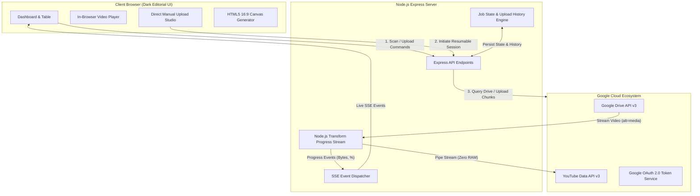
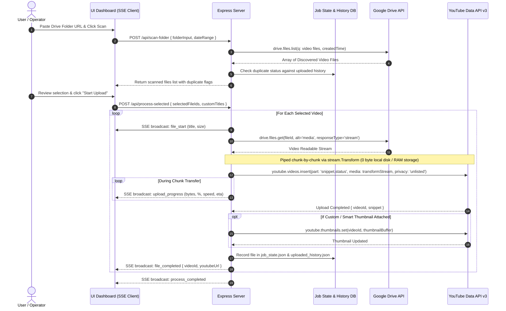
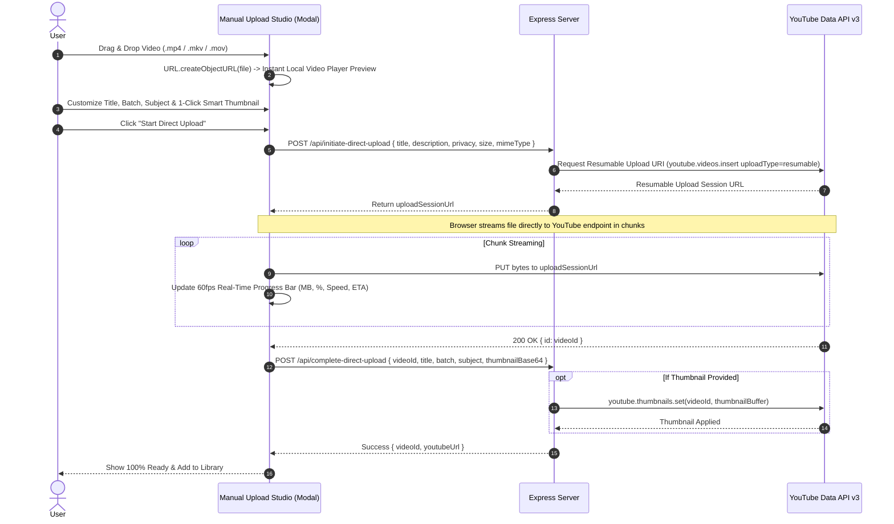

# 🎥 YouTube & Google Drive Automation Studio

A production-grade, zero-RAM streaming pipeline and video management studio built with **Node.js**, **Express**, **Tailwind CSS**, and **Server-Sent Events (SSE)**. 

Designed with a warm **Dark Editorial UI** (matching `officemobile.vercel.app`), this studio enables automated zero-RAM streaming from Google Drive to YouTube as **Unlisted** videos, plus a **Direct Local Device Upload Studio** with live in-browser preview, instant 16:9 thumbnail generator, and real-time percentage progress.

---

## ✨ Key Features & Capabilities

### 1. Dual Ingestion Pipelines
- **Google Drive Automated Pipeline:**
  - Zero-RAM chunk-by-chunk streaming via Node.js `stream.Transform` directly to YouTube.
  - Smart folder scanner with duplicate detection against previous upload history.
  - Date filtering (Today, Yesterday, Last 7 Days, or custom interactive Calendar range).
  - Customizable batch and subject lecture tagging.
- **Direct Manual Local Device Studio (`+ Manual Upload`):**
  - Drag-and-drop or file picker for local files (`.mp4`, `.mkv`, `.mov`, `.webm`, `.avi`).
  - **▶ Instant In-Browser Video Player Preview** before uploading.
  - Real-time 60fps upload progress (`0%` -> `100%`, transferred `MB/MB`, `Speed MB/s`, and remaining `ETA`).
  - Direct resumable session streaming to YouTube Data API v3.

### 2. Instant 16:9 Thumbnail Studio
- **⚡ 1-Click Smart Canvas Generator:** Automatically crafts branded 1280x720 HD thumbnails with batch labels, lecture titles, and styling.
- **Local Image Upload:** Choose PNG, JPG, or WebP files from your device.
- **Web / Drive Image Link:** Paste any Google Drive image link or web URL for auto-detection and upload.

### 3. Real-Time Streaming & Live Hero Banner
- Real-time Server-Sent Events (SSE) broadcasting live progress to all connected dashboard tabs.
- Pinned top banner showing live file name, speed, percentage bar, and ETA during active uploads.

### 4. Interactive Library & Management
- **Date Range Calendar Popover:** Visual date picker with quick presets (Today, Yesterday, Last 7 Days, All Dates).
- **Multi-Factor Search & Filtering:** Filter by status (`Completed`, `Uploading`, `Queued`, `Failed`), source (`YouTube`, `Drive`), or title/batch text.
- **Embedded Modal Player:** Watch uploaded videos or preview Drive files directly inside the application.
- **Metadata Editor:** Rename titles, adjust batch/subject tags, and replace thumbnails anytime.

### 5. Multi-User OAuth & 5-Step Guided Setup Wizard
- Built-in guided wizard to create your own Google Cloud project in 5 minutes.
- Connect your own Google account to get dedicated 10,000 units/day quota.

---

## ⚙️ How It Works Internally

The application leverages streaming architectures to process multi-gigabyte video files with minimal server resource consumption.

### 1. High-Level System Architecture



---

### 2. Google Drive to YouTube Streaming Pipeline (Zero-RAM)



---

### 3. Direct Manual Local Device Upload Pipeline



---

## 📂 Project Structure

```
.
├── server.js                   # Express server, Google APIs streaming engine, SSE hub, & REST routes
├── get-refresh-token.js        # Interactive OAuth CLI utility to generate permanent refresh_token
├── public/
│   └── index.html              # Dark editorial frontend (Dashboard, Studio, Player, Modals, SSE client)
├── data/
│   ├── job_state.json          # Persistent active and completed video records
│   └── uploaded_history.json   # Persistent history used for smart duplicate detection
├── .env.example                # Environment variables template
├── package.json                # Project dependencies and startup scripts
└── README.md                   # System documentation and architecture guide
```

---

## 🚀 Installation & Quick Start

### 1. Clone & Install Dependencies

```bash
git clone https://github.com/aniketpw/ytuploader.git
cd ytuploader
npm install
```

### 2. Configure Environment Variables

Copy `.env.example` to `.env`:

```bash
cp .env.example .env
```

Edit `.env` with your Google OAuth credentials:

```env
PORT=3000
GOOGLE_CLIENT_ID=your_client_id.apps.googleusercontent.com
GOOGLE_CLIENT_SECRET=GOCSPX-your_client_secret
GOOGLE_REDIRECT_URI=http://localhost:3000/oauth2callback
GOOGLE_REFRESH_TOKEN=1//your_permanent_refresh_token
```

*(Note: You can also use the in-app 5-step guided wizard to generate your OAuth Client ID and sign in directly from the UI without manual CLI setup).*

### 3. Generate OAuth Refresh Token (CLI Method)

```bash
npm run get-token
```
Follow the URL printed in the terminal, grant YouTube and Drive permissions, and paste the resulting refresh token into `.env`.

### 4. Start the Application

```bash
# Start production server
npm start

# Or start with nodemon development mode
npm run dev
```

Open your browser at:
```
http://localhost:3000
```

---

## 🔐 Google Cloud Console Configuration (Summary)

1. **APIs to Enable:**
   - Google Drive API
   - YouTube Data API v3
2. **OAuth Scopes Required:**
   - `https://www.googleapis.com/auth/drive.readonly`
   - `https://www.googleapis.com/auth/youtube.upload`
   - `https://www.googleapis.com/auth/youtube`
3. **Authorized JavaScript Origins:**
   - `http://localhost:3000` (or your production deployment domain)
4. **Authorized Redirect URIs:**
   - `http://localhost:3000/oauth2callback`

---

## 🛡️ License

Private and proprietary. Designed for automated Drive-to-YouTube video streaming and channel operations.
